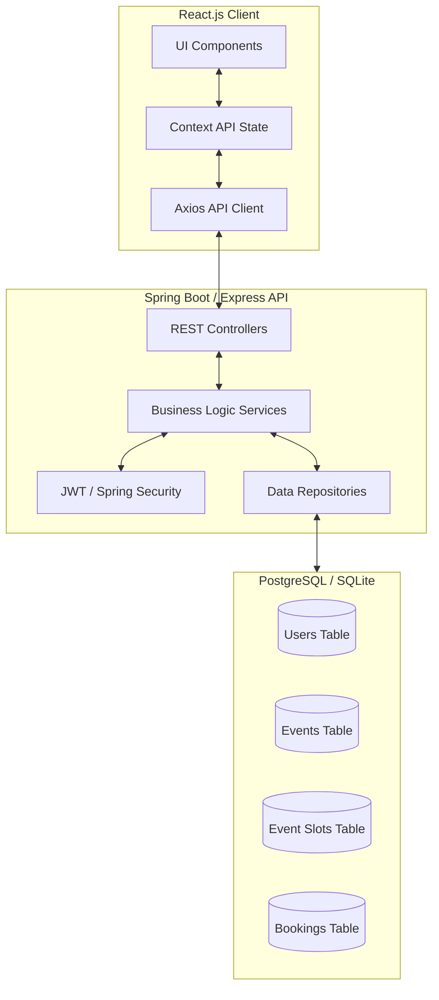

# CampusVibe - Technical Documentation

## 1. System Architecture Diagram



## 2. Database Schema (PostgreSQL)

```sql
-- Users Table
CREATE TABLE users (
    id SERIAL PRIMARY KEY,
    name VARCHAR(100) NOT NULL,
    email VARCHAR(100) UNIQUE NOT NULL,
    password VARCHAR(255) NOT NULL,
    role VARCHAR(20) CHECK (role IN ('STUDENT', 'ORGANIZER', 'ADMIN')) NOT NULL,
    club_name VARCHAR(100),
    created_at TIMESTAMP DEFAULT CURRENT_TIMESTAMP
);

-- Events Table
CREATE TABLE events (
    id SERIAL PRIMARY KEY,
    title VARCHAR(200) NOT NULL,
    description TEXT,
    date DATE NOT NULL,
    time TIME NOT NULL,
    venue VARCHAR(200) NOT NULL,
    poster_url TEXT,
    category VARCHAR(50),
    organizer_id INTEGER REFERENCES users(id),
    status VARCHAR(20) DEFAULT 'PENDING' CHECK (status IN ('PENDING', 'APPROVED', 'REJECTED')),
    created_at TIMESTAMP DEFAULT CURRENT_TIMESTAMP
);

-- Event Slots Table
CREATE TABLE event_slots (
    id SERIAL PRIMARY KEY,
    event_id INTEGER REFERENCES events(id) ON DELETE CASCADE,
    start_time TIME NOT NULL,
    end_time TIME NOT NULL,
    total_seats INTEGER NOT NULL,
    available_seats INTEGER NOT NULL
);

-- Bookings Table
CREATE TABLE bookings (
    id SERIAL PRIMARY KEY,
    user_id INTEGER REFERENCES users(id),
    slot_id INTEGER REFERENCES event_slots(id),
    booking_date TIMESTAMP DEFAULT CURRENT_TIMESTAMP,
    status VARCHAR(20) DEFAULT 'CONFIRMED'
);
```

## 3. Backend API Structure (Spring Boot Example)

### Controller Structure
- `AuthController.java`: `/api/auth/login`, `/api/auth/register`
- `EventController.java`: `/api/events` (GET, POST, PATCH)
- `BookingController.java`: `/api/bookings` (POST, GET)
- `AdminController.java`: `/api/admin/dashboard`, `/api/admin/users`

### Model Example (Event.java)
```java
@Entity
@Table(name = "events")
public class Event {
    @Id
    @GeneratedValue(strategy = GenerationType.IDENTITY)
    private Long id;
    
    private String title;
    private String description;
    private LocalDate date;
    private LocalTime time;
    private String venue;
    
    @Enumerated(EnumType.STRING)
    private EventStatus status;
    
    @ManyToOne
    @JoinColumn(name = "organizer_id")
    private User organizer;
    
    @OneToMany(mappedBy = "event", cascade = CascadeType.ALL)
    private List<EventSlot> slots;
}
```

## 4. React Component Structure

- `/src`
  - `/components`
    - `Navbar.tsx`: Sticky navigation with auth state
    - `EventCard.tsx`: Individual event preview
    - `SlotBooking.tsx`: Visual slot selection interface
    - `BookingModal.tsx`: Confirmation popup
    - `Sidebar.tsx`: Dashboard navigation
  - `/pages`
    - `Home.tsx`: Event discovery landing
    - `EventDetail.tsx`: Detailed view with booking
    - `Dashboard.tsx`: Student/Organizer personal area
    - `AdminPanel.tsx`: Event approval and user management
    - `Login.tsx` / `Register.tsx`: Auth pages
  - `/context`
    - `AuthContext.tsx`: Global auth state
  - `/services`
    - `api.ts`: Axios instance configuration
